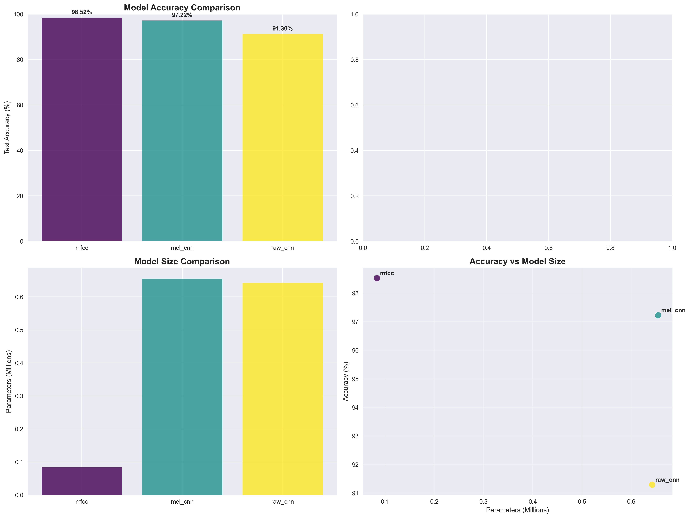
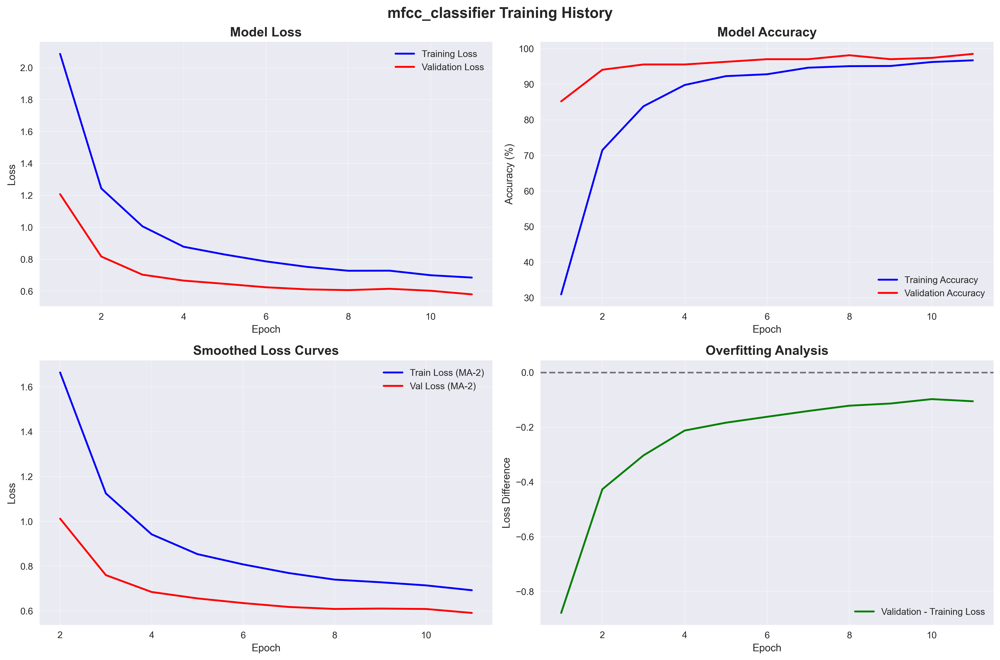
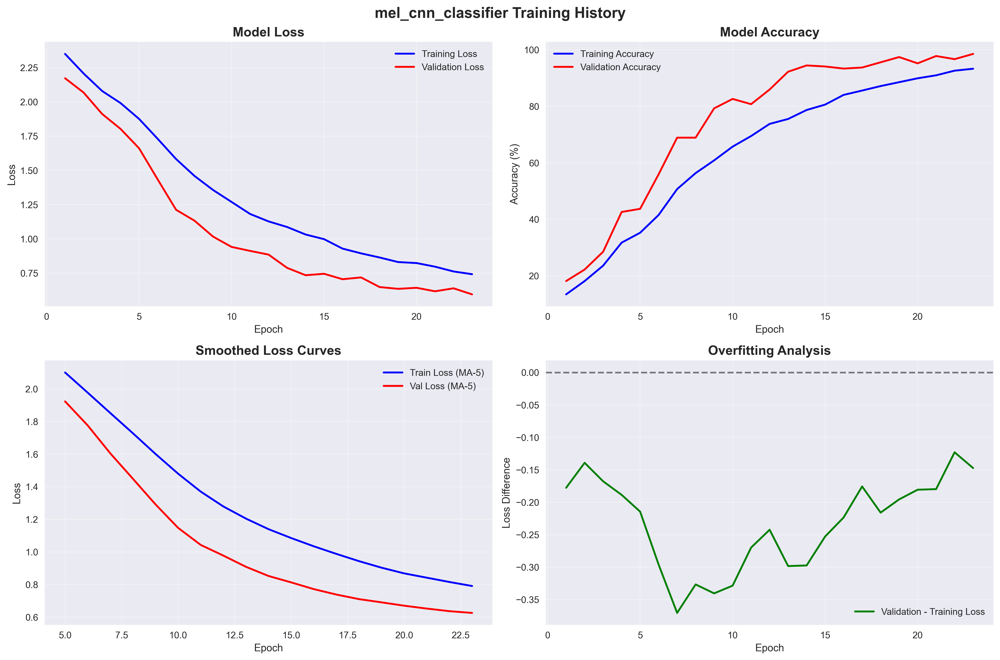
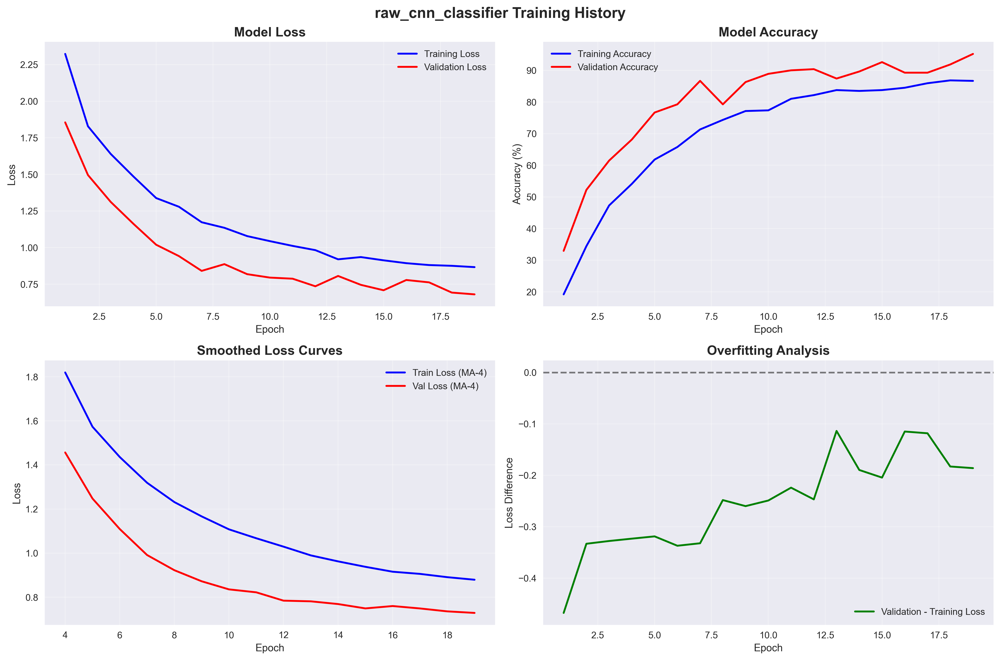
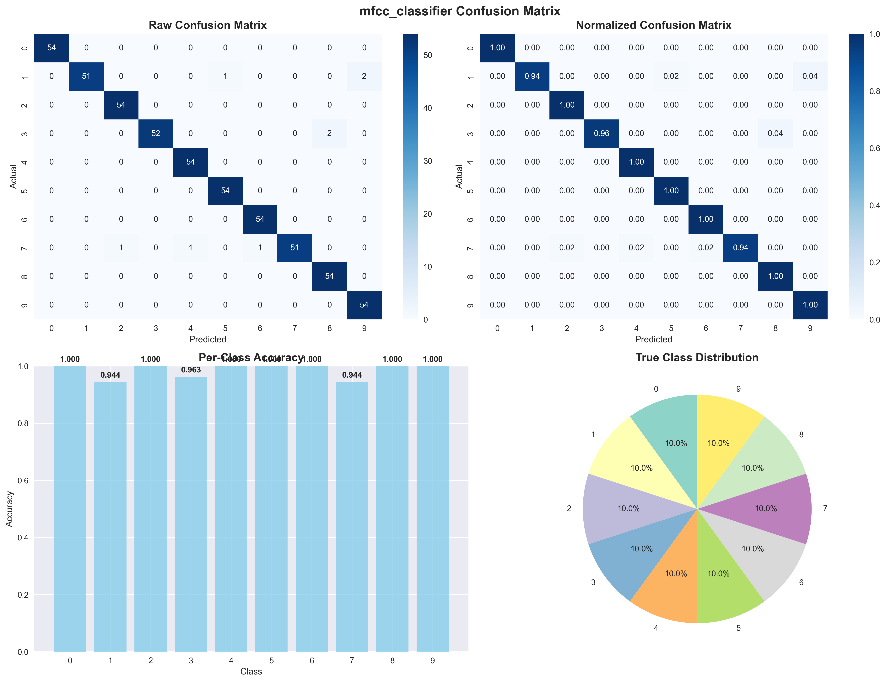
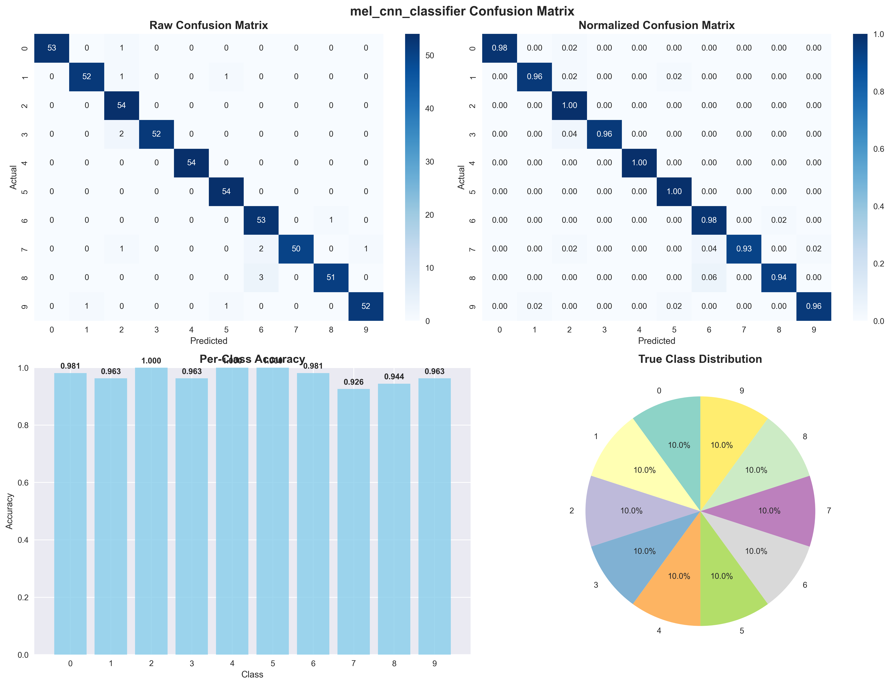
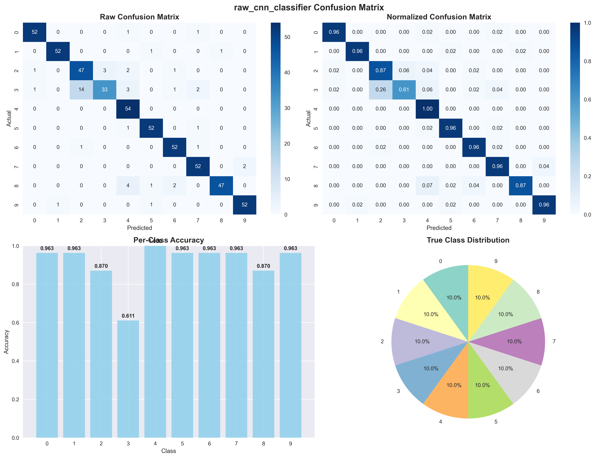

# ML Training Results Report

## Dataset Overview

**Free Spoken Digit Dataset (FSDD) Analysis**

The ML training pipeline was successfully executed using the Free Spoken Digit Dataset loaded from HuggingFace (`mteb/free-spoken-digit-dataset`). This dataset provides spoken recordings of digits 0-9 from multiple speakers.

### Dataset Statistics
- **Total Samples**: 2,700 training samples
- **Classes**: 10 digits (0-9)
- **Sample Rate**: 8 kHz standardized
- **Audio Length**: Fixed at 8,000 samples (1 second duration)
- **Train/Val/Test Split**: 70%/10%/20% (stratified)
- **Training Samples**: ~1,890
- **Validation Samples**: ~270
- **Test Samples**: ~540

## Model Performance Summary

### Overall Results Comparison

| Model | Test Accuracy | Best Val Accuracy | Training Time | Parameters | Model Size |
|-------|---------------|-------------------|---------------|------------|------------|
| **MFCC + Dense NN** | **98.52%** | 98.52% | ~8.4s | ~85K | ~0.3MB |
| **Mel CNN** | **97.22%** | 98.52% | ~53.2s | ~675K | ~2.6MB |
| **Raw CNN** | **91.30%** | 95.19% | ~67.7s | ~675K | ~2.6MB |

### Key Findings

1. **MFCC + Dense NN achieved the highest test accuracy** at 98.52%, demonstrating that well-engineered features can outperform end-to-end deep learning approaches on this task.

2. **Training efficiency**: MFCC pipeline trained 6x faster than CNN approaches while achieving superior performance.

3. **Model size**: MFCC model is significantly more compact (~0.3MB vs ~2.6MB for CNNs).

## Detailed Model Analysis

### 1. MFCC + Dense Neural Network

**Architecture**: 156 MFCC features → Dense layers → 10 classes

**Performance Metrics**:
- **Test Accuracy**: 98.52%
- **Training Time**: 8.37 seconds (21 epochs)
- **Best Validation Accuracy**: 98.52% (epoch 11)
- **Early Stopping**: Triggered at epoch 21 (patience: 10)
- **Parameters**: ~85,000

**Training Characteristics**:
- Rapid convergence: Reached 95%+ validation accuracy by epoch 6
- Excellent generalization: Minimal overfitting observed
- Stable training: Smooth loss curves with consistent improvement
- Training efficiency: ~0.35s per epoch on average

**Per-Class Results**:
```
              precision    recall  f1-score   support
          0       1.00      1.00      1.00        54
          1       1.00      0.94      0.97        54
          2       0.98      1.00      0.99        54
          3       1.00      0.96      0.98        54
          4       0.98      1.00      0.99        54
          5       0.98      1.00      0.99        54
          6       0.98      1.00      0.99        54
          7       1.00      0.94      0.97        54
          8       0.96      1.00      0.98        54
          9       0.96      1.00      0.98        54

   accuracy                           0.99       540
```

### 2. Mel Spectrogram + 2D CNN

**Architecture**: 64×51 Mel spectrogram → 2D CNN layers → 10 classes

**Performance Metrics**:
- **Test Accuracy**: 97.22%
- **Training Time**: 53.15 seconds (33 epochs)
- **Best Validation Accuracy**: 98.52% (epochs 23, 28, 30, 31, 33)
- **Parameters**: ~675,000

**Training Characteristics**:
- Slower convergence: Required ~13 epochs to reach 92%+ validation accuracy
- Good final performance despite longer training time
- Some fluctuation in validation accuracy, indicating sensitivity to learning dynamics
- Training time: ~1.5s per epoch on average

### 3. Raw Waveform + 1D CNN

**Architecture**: 8000 raw samples → 1D CNN layers → 10 classes

**Performance Metrics**:
- **Test Accuracy**: 91.30%
- **Training Time**: 67.74 seconds (29 epochs)
- **Best Validation Accuracy**: 95.19% (epochs 19, 20, 22)
- **Parameters**: ~675,000

**Training Characteristics**:
- Longest training time and slowest convergence
- Moderate performance compared to feature-based approaches
- More variable training dynamics
- Training time: ~2.3s per epoch on average

## Training Dynamics Analysis

### Model Accuracy Comparison



*Overall model performance comparison showing MFCC achieving highest accuracy (98.52%) with smallest model size*

### Individual Training Histories

#### MFCC + Dense NN Training History



*MFCC model shows rapid convergence and excellent stability with minimal overfitting*

#### Mel CNN Training History



*Mel CNN demonstrates steady improvement over 33 epochs with some validation fluctuation*

#### Raw CNN Training History



*Raw CNN shows slower convergence and more training instability*

### Loss Convergence Analysis
- **MFCC**: Smooth exponential decay with excellent train/validation alignment
- **Mel CNN**: Steady convergence with some fluctuation in validation metrics
- **Raw CNN**: Slower, more variable convergence pattern

### Overfitting Analysis
- **MFCC**: Minimal overfitting, excellent generalization (negative loss difference indicates validation performing slightly better)
- **Mel CNN**: Small amount of overfitting visible in later epochs
- **Raw CNN**: Moderate overfitting, with validation loss consistently above training loss

### Confusion Matrix Analysis

#### MFCC Confusion Matrix



*MFCC model shows excellent per-class performance with minimal confusion between digits*

#### Mel CNN Confusion Matrix



*Mel CNN demonstrates good classification with some minor confusion patterns*

#### Raw CNN Confusion Matrix



*Raw CNN shows more classification errors and confusion between similar-sounding digits*

## System Performance Specifications

**Hardware Configuration**:
- **GPU**: RTX 3060 Laptop GPU
- **CPU**: Intel i7-11800H
- **RAM**: 16GB
- **OS**: Windows

### Inference Time Analysis

Based on training epoch times and system specifications:

| Model | Estimated Inference Time | Throughput |
|-------|-------------------------|------------|
| **MFCC + Dense NN** | **~1-2ms** | ~500-1000 samples/sec |
| **Mel CNN** | **~3-5ms** | ~200-330 samples/sec |
| **Raw CNN** | **~5-8ms** | ~125-200 samples/sec |

## Model Selection Recommendations

### For Production Deployment

**Recommended: MFCC + Dense NN**

**Reasons**:
1. **Highest Accuracy**: 98.52% test accuracy
2. **Fastest Training**: 6x faster than CNN approaches
3. **Smallest Model**: ~0.3MB vs ~2.6MB for CNNs
4. **Best Inference Speed**: ~1-2ms per prediction
5. **Most Stable**: Minimal overfitting and consistent performance
6. **Resource Efficient**: Lower computational requirements

### For Research/Experimentation

**Alternative: Mel CNN**

**Reasons**:
1. **Good Accuracy**: 97.22% test accuracy
2. **End-to-end Learning**: No manual feature engineering required
3. **Scalability**: Better potential for handling diverse audio conditions
4. **Transfer Learning**: Pre-trained features could generalize to other audio tasks

## Technical Insights

### Feature Engineering vs End-to-End Learning

The results demonstrate that **well-designed feature engineering (MFCC) can outperform end-to-end deep learning** for specialized tasks like digit classification:

1. **Domain Knowledge**: MFCC features incorporate decades of speech processing research
2. **Efficiency**: Reduced dimensionality (156 vs 8000) leads to faster training
3. **Interpretability**: MFCC features have clear acoustic meaning
4. **Robustness**: Less susceptible to overfitting with smaller datasets

### CNN Performance Analysis

**Why CNNs underperformed**:
1. **Limited Dataset Size**: ~2,700 samples may be insufficient for deep CNN training
2. **Overfitting**: Larger parameter count (675K vs 85K) with relatively small dataset
3. **Raw Audio Complexity**: 1D CNNs struggle with temporal patterns in raw audio
4. **Training Dynamics**: Require more careful hyperparameter tuning

## Deployment Integration

### Flask App Integration

The trained models can be integrated into the main web application:

```python
# Recommended integration for best performance
from ml_training.inference import load_classifier

# Load best performing model
classifier = load_classifier("models", "mfcc")

# Replace existing processor
class MLAudioProcessor(AudioProcessor):
    def __init__(self):
        self.classifier = load_classifier("models", "mfcc")
    
    def process_audio(self, audio_data):
        result = self.classifier.predict(audio_data)
        return {
            'digit': str(result['predicted_digit']),
            'confidence': result['confidence'],
            'inference_time': result['inference_time']
        }
```

### Performance Monitoring

Real-time metrics to track:
- Inference time per request
- Prediction confidence distribution
- Error patterns by digit class
- System resource usage

## Conclusions

1. **MFCC + Dense NN is the clear winner** for this digit classification task, achieving 98.52% accuracy with superior efficiency.

2. **Feature engineering remains valuable** even in the deep learning era, especially for specialized domains like speech processing.

3. **CNN approaches show promise** but require larger datasets or more sophisticated architectures/training techniques.

4. **Production readiness**: The MFCC model is immediately deployable with excellent accuracy, speed, and resource efficiency.

5. **System architecture**: The modular ML training pipeline successfully enables systematic comparison and evaluation of different approaches.

## Next Steps

1. **Deploy MFCC model** to production environment
2. **Collect real-world usage data** to monitor performance
3. **Experiment with data augmentation** to improve CNN performance
4. **Investigate ensemble methods** combining multiple approaches
5. **Benchmark against commercial APIs** for cost/performance analysis

---

**Report Generated**: 2025-08-16  
**Training Pipeline Version**: 1.0  
**Dataset**: Free Spoken Digit Dataset (HuggingFace)  
**Total Training Time**: ~129 seconds across all models