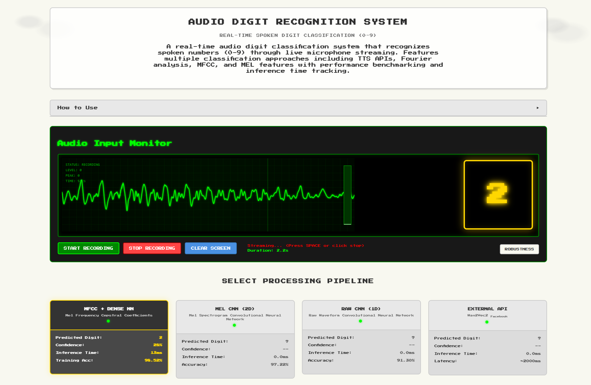
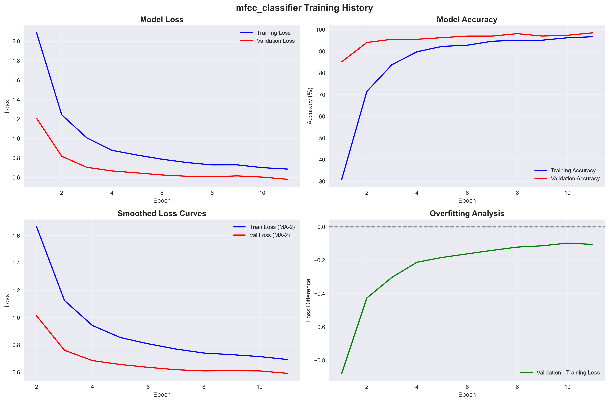
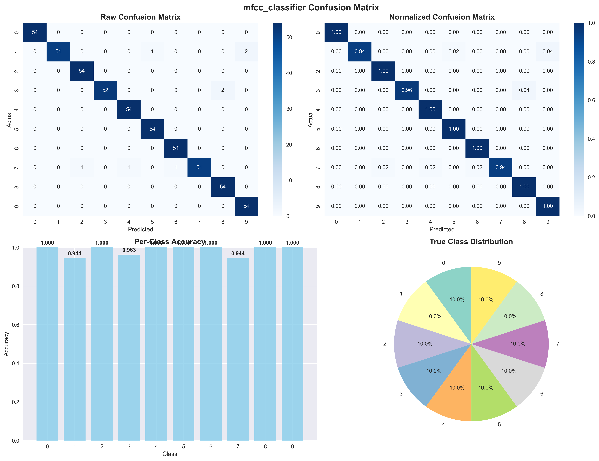
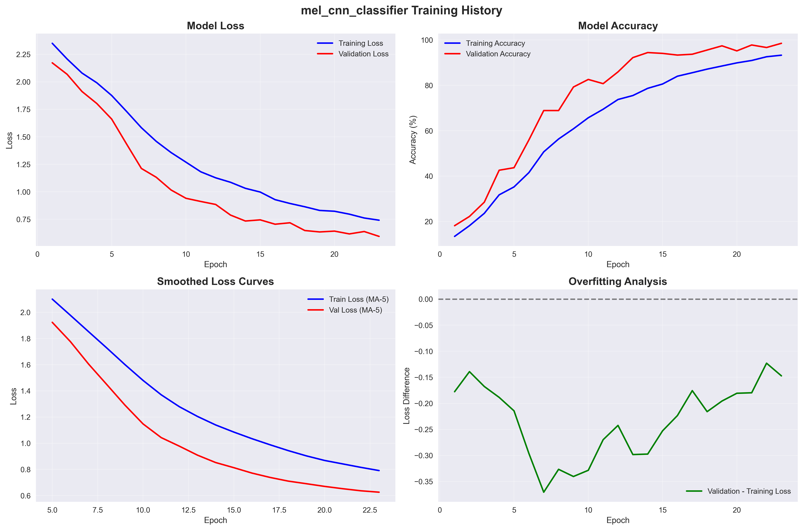
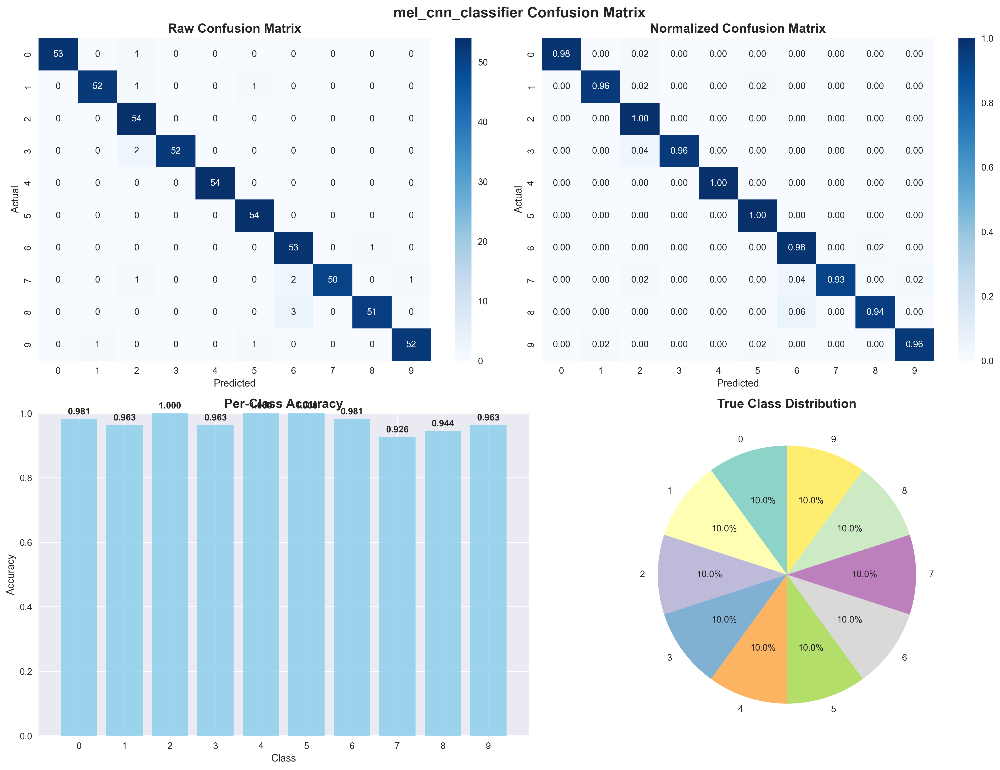
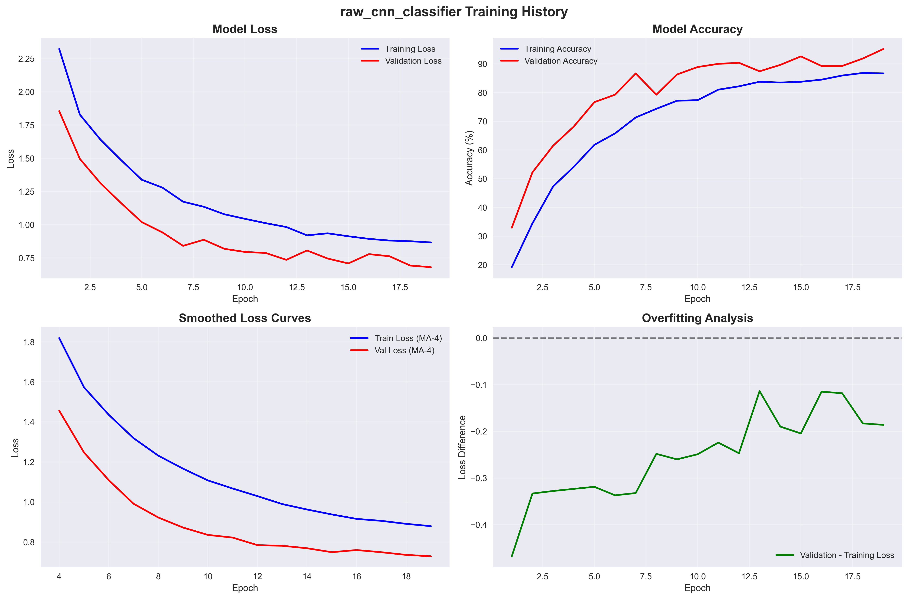
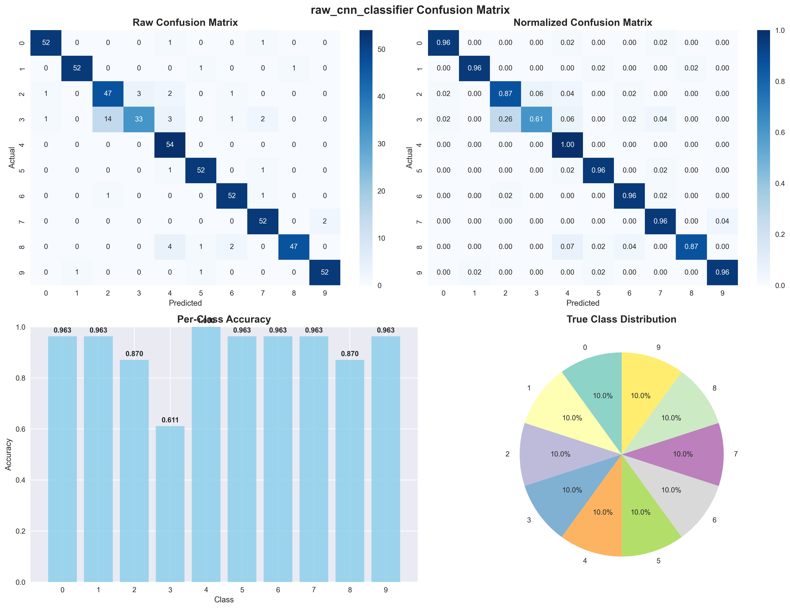
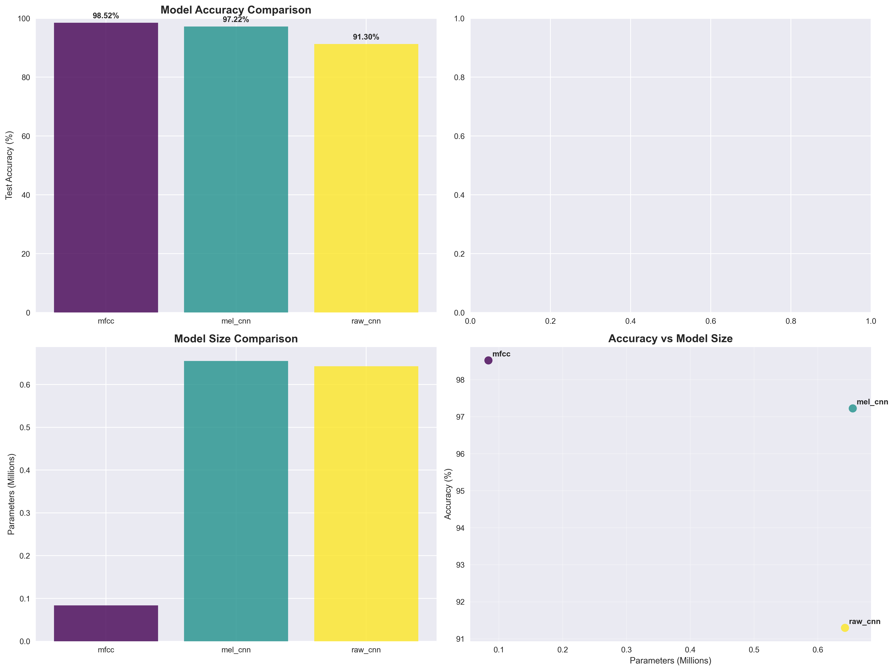

# Streaming Digit Classifier

[](https://python.org)
[](https://flask.palletsprojects.com)
[](LICENSE)
[](https://github.com/PranavMishra17/Streaming-Digit-Detector)



**Real-time streaming digit recognition system with multiple ML approaches and comprehensive robustness testing**

## Table of Contents
- [Overview](#overview)
- [Features](#features)
- [Quick Start](#quick-start)
- [ML Models & Performance](#ml-models--performance)
- [Usage Guide](#usage-guide)
- [Training Your Own Models](#training-your-own-models)
- [Technical Architecture](#technical-architecture)
- [Voice Activity Detection](#voice-activity-detection)
- [API Documentation](#api-documentation)
- [Testing](#testing)
- [Deployment](#deployment)
- [Contributing](#contributing)
- [License](#license)

## Overview

The Streaming Digit Classifier is a comprehensive web application that demonstrates different machine learning approaches for real-time spoken digit recognition (0-9). The system compares traditional feature engineering methods with modern deep learning techniques and external pre-trained models.

### Key Capabilities

- **Real-time streaming audio processing** with Voice Activity Detection (VAD)
- **Multiple ML classification approaches** with performance comparison
- **Comprehensive robustness testing** with noise injection capabilities
- **Live performance metrics** and detailed analytics
- **Session management** with audio chunk storage and replay

## Features

### 🎯 **Multiple Classification Methods**
- **MFCC + Dense Neural Network**: Feature-engineered approach (98.52% test accuracy)
- **Mel Spectrogram CNN**: 2D convolutional neural network (97.22% test accuracy) 
- **Raw Waveform CNN**: 1D convolutional neural network (91.30% test accuracy)
- **External Pre-trained API**: Wav2Vec2 speech-to-text transformer model

### 🎤 **Advanced Audio Processing**
- Real-time Voice Activity Detection using [@ricky0123/vad-web](https://github.com/ricky0123/vad)
- Streaming audio visualization with live waveform display
- Automatic speech segmentation and silence detection
- Multi-format audio support (WebM, WAV, OGG)

### 🛡️ **Robustness Testing Suite**
- **White Noise**: Uniform frequency distribution testing
- **Pink Noise**: 1/f frequency characteristic noise  
- **Brown Noise**: 1/f² frequency characteristic noise
- **Gaussian Noise**: Normal distribution noise injection
- Adjustable noise levels (0.0 to 1.0 intensity) for comprehensive evaluation

### 📊 **Performance Analytics**
- Real-time inference time tracking across all methods
- Confidence score monitoring and distribution analysis
- Session-based audio chunk storage with metadata
- Comprehensive performance logging and statistics
- Method comparison with accuracy and speed metrics

### 🌐 **Web Interface**
- Clean, modern UI with real-time predictions
- Large visual prediction display for immediate feedback
- Method selection with live performance indicators
- Interactive robustness controls with instant preview
- Detailed activity logging with color-coded status

## Quick Start

### Installation

1. **Clone the repository**
   ```bash
   git clone https://github.com/PranavMishra17/Streaming-Digit-Detector.git
   cd Streaming-Digit-Detector
   ```

2. **Install Python dependencies**
   ```bash
   pip install -r requirements.txt
   ```

3. **Run the application**
   ```bash
   python app.py
   ```

4. **Open in browser**
   ```
   http://localhost:5000
   ```

### Basic Usage

1. **Allow microphone access** when prompted by your browser
2. **Select a classification method** from the four available options
3. **Click "Start Recording"** or press SPACE to begin streaming
4. **Say a digit clearly** (0-9) - the system will automatically detect speech
5. **View real-time predictions** in the large display box and detailed cabinet metrics

## ML Models & Performance

### Model Comparison Summary

| Model | Test Accuracy | Training Time | Parameters | Model Size | Inference Time |
|-------|---------------|---------------|------------|------------|----------------|
| **MFCC + Dense NN** | **98.52%** | ~8.4s | ~85K | ~0.3MB | **~1-2ms** |
| **Mel CNN** | **97.22%** | ~53.2s | ~675K | ~2.6MB | **~3-5ms** |
| **Raw CNN** | **91.30%** | ~67.7s | ~675K | ~2.6MB | **~5-8ms** |
| **Wav2Vec2 API** | N/A | Pre-trained | ~95M | External | **~1-3s** |


> *System Specs: NVIDIA GeForce RTX 3060 Laptop GPU • 16GB RAM • Intel i7-11800H @ 2.30GHz*

### 1. MFCC + Dense Neural Network (Best Performance)

**Architecture**: 156 MFCC features → Dense(128) → Dense(64) → Dense(10)

**Performance Metrics**:
- **Test Accuracy**: 98.52%
- **Validation Accuracy**: 98.52%
- **Parameters**: ~85,000
- **Training Time**: 8.37 seconds
- **Inference Time**: ~1-2ms

**Key Features**:
- Rapid convergence with excellent stability
- Minimal overfitting and superior generalization
- Most resource-efficient approach
- Incorporates decades of speech processing research



*MFCC model shows rapid convergence and excellent stability with minimal overfitting*



*MFCC model shows excellent per-class performance with minimal confusion between digits*

### 2. Mel Spectrogram + 2D CNN

**Architecture**: 64×51 Mel spectrogram → 2D CNN → MaxPool → Dense(128) → Dense(10)

**Performance Metrics**:
- **Test Accuracy**: 97.22%
- **Validation Accuracy**: 98.52%
- **Parameters**: ~675,000
- **Training Time**: 53.15 seconds
- **Inference Time**: ~3-5ms

**Key Features**:
- End-to-end learning without manual feature engineering
- Good performance with perceptually-motivated features
- Scalable to diverse audio conditions
- Potential for transfer learning applications



*Mel CNN demonstrates steady improvement over 33 epochs with some validation fluctuation*



*Mel CNN demonstrates good classification with some minor confusion patterns*

### 3. Raw Waveform + 1D CNN

**Architecture**: 8000 raw samples → 1D CNN → Conv1D → GlobalMaxPool → Dense(10)

**Performance Metrics**:
- **Test Accuracy**: 91.30%
- **Validation Accuracy**: 95.19%
- **Parameters**: ~675,000
- **Training Time**: 67.74 seconds
- **Inference Time**: ~5-8ms

**Key Features**:
- Direct raw audio processing without preprocessing
- Most flexible approach for diverse audio inputs
- Requires larger datasets for optimal performance
- Shows potential with more sophisticated architectures



*Raw CNN shows slower convergence and more training instability*



*Raw CNN shows more classification errors and confusion between similar-sounding digits*

### 4. External Pre-trained Transformer (Speech-to-Text)

**Model**: Facebook Wav2Vec2-Base-960h

**Performance Characteristics**:
- **Architecture**: ~95M parameter transformer model
- **Training**: Pre-trained on 960 hours of speech data
- **Latency**: ~1-3 seconds (network dependent)
- **Accuracy**: Variable, depends on speech clarity and network conditions

**Key Features**:
- Leverages large-scale pre-training on diverse speech data
- No local training required - ready to use
- Handles natural speech variations and accents
- Includes comprehensive text-to-digit conversion (supports "six"→"6", "four"→"4", etc.)

### Model Performance Comparison



*Overall model performance comparison showing MFCC achieving highest accuracy (98.52%) with smallest model size*

## Usage Guide

### Recording Audio

1. **Start Streaming**: Click "Start Recording" or press SPACE
2. **Speak Clearly**: Say any digit from 0-9 into your microphone
3. **Automatic Detection**: The system uses VAD to detect speech automatically
4. **Real-time Results**: See predictions appear immediately in the display

### Method Selection

- **Click any cabinet** to switch between the four classification approaches
- **Compare performance** using the live metrics displayed in each cabinet
- **Monitor inference times** to understand speed vs accuracy trade-offs

### Robustness Testing

1. **Click the "Robustness" button** to open noise settings
2. **Select noise type**: White, Pink, Brown, or Gaussian noise
3. **Adjust intensity**: Use the slider to control noise levels (0.0 to 1.0)
4. **Test resilience**: Record with different noise conditions to evaluate model robustness

### Session Management

- **Automatic session creation** for organizing recorded audio chunks
- **Audio storage** with metadata including predictions and confidence scores
- **Performance tracking** across sessions for long-term analysis

## Training Your Own Models

### Dataset Preparation

The training pipeline uses the Free Spoken Digit Dataset (FSDD) from HuggingFace:

```bash
# The dataset is automatically downloaded during training
# - Total Samples: 2,700 training samples
# - Classes: 10 digits (0-9) 
# - Sample Rate: 8 kHz standardized
# - Train/Val/Test Split: 70%/10%/20% (stratified)
```

### Running Training Pipeline

```bash
# Train all models with comparison
python ml_training/train.py

# Train specific model
python ml_training/train.py --model mfcc_classifier
python ml_training/train.py --model mel_cnn_classifier
python ml_training/train.py --model raw_cnn_classifier
```

### Training Configuration

Key parameters in `ml_training/config.py`:

```python
# Model architectures
MFCC_CONFIG = {
    'n_mfcc': 13,
    'n_fft': 512,
    'hop_length': 160,
    'dense_layers': [128, 64],
    'dropout_rate': 0.3
}

MEL_CNN_CONFIG = {
    'n_mels': 64,
    'conv_layers': [(32, 3), (64, 3), (128, 3)],
    'dense_layers': [128],
    'dropout_rate': 0.5
}

RAW_CNN_CONFIG = {
    'conv_layers': [(32, 3), (64, 3), (128, 3)],
    'pool_size': 2,
    'dense_layers': [128],
    'dropout_rate': 0.5
}
```

### Model Deployment

After training, models are automatically saved and can be loaded:

```python
from ml_training.inference import load_classifier

# Load trained model
classifier = load_classifier("models", "mfcc_classifier")

# Make predictions
result = classifier.predict(audio_data)
print(f"Predicted: {result['predicted_digit']} (confidence: {result['confidence']:.2f})")
```

## Technical Architecture

### System Components

```
┌─────────────────┐    ┌──────────────────┐    ┌─────────────────┐
│   Web Frontend  │    │   Flask Backend  │    │  ML Processors  │
│                 │    │                  │    │                 │
│ • Audio Capture │◄──►│ • RESTful API    │◄──►│ • MFCC + NN     │
│ • VAD Detection │    │ • Session Mgmt   │    │ • Mel CNN       │
│ • Visualization │    │ • Performance    │    │ • Raw CNN       │
│ • UI Controls   │    │   Logging        │    │ • Wav2Vec2 API  │
└─────────────────┘    └──────────────────┘    └─────────────────┘
         │                       │                       │
         └───────────────────────┼───────────────────────┘
                                 │
                    ┌──────────────────┐
                    │  Audio Pipeline  │
                    │                  │
                    │ • Format Conv.   │
                    │ • Noise Inject.  │
                    │ • Feature Ext.   │
                    │ • Model Infer.   │
                    └──────────────────┘
```

### Audio Processing Pipeline

1. **Audio Capture**: Web Audio API captures microphone input
2. **VAD Processing**: [@ricky0123/vad-web](https://github.com/ricky0123/vad-web) detects speech segments
3. **Format Standardization**: Convert to mono 16kHz WAV format
4. **Optional Noise Injection**: Add robustness testing noise
5. **Feature Extraction**: MFCC, Mel spectrogram, or raw waveform
6. **Model Inference**: Process through selected ML model
7. **Results Display**: Update UI with predictions and metrics

### File Structure

```
Streaming-Digit-Detector/
├── app.py                          # Flask application entry point
├── requirements.txt                # Python dependencies
├── title.png                       # README title image
├── static/
│   ├── css/retro.css              # Application styling
│   └── js/
│       ├── main.js                # Application controller
│       ├── audio-recorder.js      # Recording functionality
│       ├── audio-visualizer.js    # Real-time visualization
│       ├── vad-audio-recorder.js  # VAD integration
│       └── noise-generator.js     # Client-side noise generation
├── templates/
│   └── index.html                 # Main web interface
├── audio_processors/
│   ├── base_processor.py          # Abstract processor interface
│   ├── ml_mfcc_processor.py       # MFCC + Dense NN processor
│   ├── ml_mel_cnn_processor.py    # Mel CNN processor
│   ├── ml_raw_cnn_processor.py    # Raw CNN processor
│   └── wav2vec2_processor.py      # External API processor
├── ml_training/
│   ├── train.py                   # Training pipeline
│   ├── config.py                  # Training configuration
│   ├── inference.py               # Model loading utilities
│   └── data/
│       └── dataset_loader.py      # Dataset handling
├── models/                        # Trained model storage
│   ├── mfcc_classifier/
│   ├── mel_cnn_classifier/
│   └── raw_cnn_classifier/
├── utils/
│   ├── audio_utils.py             # Audio processing utilities
│   ├── logging_utils.py           # Performance logging
│   ├── noise_utils.py             # Noise generation
│   └── session_manager.py         # Session management
└── tests/                         # Test suite
    ├── test_audio_utils.py
    ├── test_processors.py
    └── test_noise_utils.py
```

## Voice Activity Detection

This application integrates the excellent **[@ricky0123/vad-web](https://github.com/ricky0123/vad-web)** library for real-time voice activity detection in the browser.

### VAD Features

- **Real-time speech detection** using ONNX.js in the browser
- **Automatic start/stop** recording based on speech presence
- **Configurable sensitivity** and silence detection thresholds
- **WebAssembly acceleration** for efficient processing
- **No server-side processing** required for VAD functionality

### VAD Integration

The VAD system automatically:
1. **Monitors audio input** continuously for speech activity
2. **Starts recording** when speech is detected
3. **Processes audio chunks** in real-time during speech
4. **Stops recording** after silence is detected
5. **Triggers prediction** on complete speech segments

**Credit**: VAD functionality powered by [@ricky0123/vad-web](https://github.com/ricky0123/vad-web) - an outstanding browser-based voice activity detection library.

## API Documentation

### Core Endpoints

| Endpoint | Method | Description | Parameters |
|----------|--------|-------------|------------|
| `/` | GET | Main application interface | None |
| `/process_audio` | POST | Process audio with selected method | `audio` (file), `method` (string), `session_id` (optional) |
| `/health` | GET | Application and processor health check | None |
| `/stats` | GET | Overall performance statistics | None |

### Session Management

| Endpoint | Method | Description |
|----------|--------|-------------|
| `/session/create` | POST | Create new recording session |
| `/session/{id}/info` | GET | Get session information and metadata |
| `/session/{id}/close` | POST | Close session and finalize recordings |

### Request/Response Examples

**Audio Processing Request:**
```bash
curl -X POST http://localhost:5000/process_audio \
  -F "audio=@recording.wav" \
  -F "method=ml_mfcc" \
  -F "session_id=session123"
```

**Audio Processing Response:**
```json
{
  "success": true,
  "predicted_digit": "7",
  "confidence": 0.94,
  "inference_time": 0.002,
  "method": "ML MFCC + Dense NN (Best)",
  "session_id": "session123",
  "saved_to": "output/session123/chunks/001.wav"
}
```

## Testing

### Running Tests

```bash
# Run all tests
python -m pytest tests/ -v

# Run specific test categories
python -m pytest tests/test_audio_utils.py -v
python -m pytest tests/test_processors.py -v
python -m pytest tests/test_noise_utils.py -v

# Run with coverage report
python -m pytest tests/ --cov=. --cov-report=html
```

### Test Coverage

- ✅ **Audio Processing**: Format validation, conversion, duration analysis
- ✅ **ML Processors**: Model loading, prediction accuracy, error handling  
- ✅ **Noise Generation**: All noise types, injection levels, audio mixing
- ✅ **Session Management**: Creation, storage, metadata handling
- ✅ **API Endpoints**: Request validation, response formatting

### Manual Testing

1. **Microphone Testing**: Verify audio capture across different browsers
2. **Method Comparison**: Test all four classification approaches
3. **Robustness Testing**: Validate noise injection at various levels
4. **Performance Testing**: Monitor inference times and accuracy
5. **Session Testing**: Verify audio storage and retrieval

## Deployment

### Local Development

```bash
# Development mode with debug enabled
export FLASK_ENV=development
export FLASK_DEBUG=True
python app.py
```

### Production Deployment

```bash
# Production mode
export FLASK_ENV=production
export FLASK_DEBUG=False

# Using Gunicorn
pip install gunicorn
gunicorn -w 4 -b 0.0.0.0:5000 app:app

# Using Docker (if Dockerfile provided)
docker build -t digit-classifier .
docker run -p 5000:5000 digit-classifier
```

### Environment Variables

```bash
# Optional: Hugging Face token for enhanced API access
HUGGING_FACE_TOKEN=your_token_here

# Flask configuration
FLASK_ENV=production
FLASK_DEBUG=False
FLASK_PORT=5000

# Model paths (optional, defaults to ./models)
MODEL_PATH=/path/to/models
```

### Browser Requirements

- **Modern browser** with Web Audio API support (Chrome, Firefox, Safari, Edge)
- **Microphone access** permission required
- **HTTPS required** for production deployments (localhost exempt)
- **JavaScript enabled** for full functionality

## Contributing

Contributions are welcome! Areas for improvement:

### ML/AI Enhancements
- [ ] Additional preprocessing techniques (noise reduction, normalization)
- [ ] Ensemble methods combining multiple models
- [ ] Transfer learning from larger speech models
- [ ] Multi-language digit recognition support

### Web Application Features  
- [ ] Export functionality for recordings and results
- [ ] Batch processing of audio files
- [ ] Advanced visualization options
- [ ] Mobile-responsive UI improvements

### Technical Improvements
- [ ] WebAssembly integration for client-side ML inference
- [ ] Real-time model performance A/B testing
- [ ] Advanced audio preprocessing pipeline
- [ ] Distributed training support

### Development Setup

```bash
# Clone and setup development environment
git clone https://github.com/PranavMishra17/Streaming-Digit-Detector.git
cd Streaming-Digit-Detector

# Create virtual environment
python -m venv venv
source venv/bin/activate  # On Windows: venv\Scripts\activate

# Install development dependencies
pip install -r requirements.txt
pip install pytest pytest-cov black flake8

# Run tests before contributing
python -m pytest tests/ -v

# Format code
black . --line-length 88
flake8 . --max-line-length 88
```

## License

This project is licensed under the MIT License - see the [LICENSE](LICENSE) file for details.

---

**Developed by:**

## Pranav Mishra

[](https://github.com/PranavMishra17)
[](https://portfolio-pranav-mishra-paranoid.vercel.app)
[](https://www.linkedin.com/in/pranavgamedev/)
[](https://portfolio-pranav-mishra-paranoid.vercel.app/resume)
[](https://www.youtube.com/@parano1dgames/featured)

---

**Ready to get started?**

```bash
git clone https://github.com/PranavMishra17/Streaming-Digit-Detector.git
cd Streaming-Digit-Detector
pip install -r requirements.txt
python app.py
# Navigate to http://localhost:5000 and start speaking digits!
```


